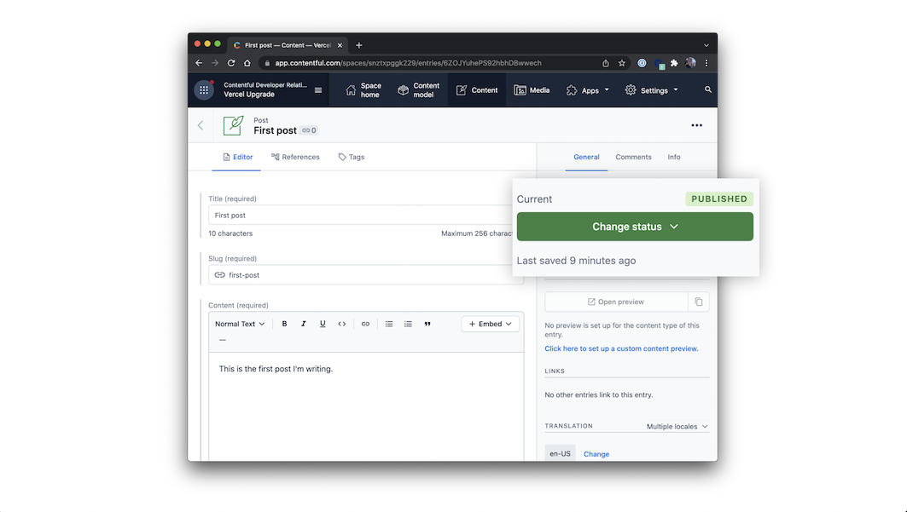

# Nothing Blog

## Description

This project showcases a dynamic, mobile-responsive, and SEO-friendly blog using Next.js and Contentful CMS, resulting in an optimal user experience across devices and improved search engine rankings. It Leverages Contentful's headless CMS to manage and store blog content, enabling easy content updates and improvements without requiring technical knowledge and showcasing proficiency in using CMS to create rich and engaging content. Utilizes webhooks and the revalidate API to automatically publish new content to the deployed site, streamlining the content management process and ensuring timely updates for site visitors while demonstrating the ability to integrate CMS with other technologies to optimize content delivery and management.

Deployed link: [https://nothing-blog.vercel.app/](https://nothing-blog.vercel.app/)


## Table of Contents

- [How to use](#how-to-use)
- [Configuration](#onfiguration)
- [Technologies](#technologies)
- [Questions](#questions)

## How to use

Execute [`create-next-app`](https://github.com/vercel/next.js/tree/canary/packages/create-next-app) with [npm](https://docs.npmjs.com/cli/init), [Yarn](https://yarnpkg.com/lang/en/docs/cli/create/), or [pnpm](https://pnpm.io) to bootstrap the example:

```bash
npx create-next-app --example cms-contentful cms-contentful-app
```

```bash
yarn create next-app --example cms-contentful cms-contentful-app
```

```bash
pnpm create next-app --example cms-contentful cms-contentful-app
```

## Configuration

### Step 1. Create an account and a space on Contentful

First, [create an account on Contentful](https://www.contentful.com/sign-up/).

After creating an account, create a new empty **space** from the [dashboard](https://app.contentful.com/) and assign to it any name of your liking.

### Step 2. Create a content model

The [content model](https://www.contentful.com/developers/docs/concepts/data-model/) defines the data structures of your application/websites. The structures are flexible and you can tailor them to your needs.

For this example you need to create a content model that defines an author and a post content type. **You can create these two by running a script or by doing it manually** to familiarize yourself with the Contentful user interface.

#### Run a script to create the content model

This project includes a setup script which you can use to set up the content model expected by the source code.

In your Contentful dashboard go to **Settings > General Settings** and copy the **Space ID**.

Next, go to **Settings > API > Content management tokens** and create a new token by clicking **Generate personal token**. This token has the same access rights as the logged in user. **Do not share it publicly**, you will only use it to set up your space and can delete it afterwards.

With the space ID and management access token at hand run the following command:

```
npx cross-env CONTENTFUL_SPACE_ID=YOUR_SPACE_ID CONTENTFUL_MANAGEMENT_TOKEN=XXX npm run setup
```

This command will create the needed content structures and set up your Contentful space ready to use. The output should look as follows:

```
> cms-contentful@1.0.0 setup /Users/stefan.judis/Projects/next.js/examples/cms-contentful
> node ./contentful/setup.js $CONTENTFUL_SPACE_ID $CONTENTFUL_MANAGEMENT_TOKEN

┌──────────────────────────────────────────────────┐
│ The following entities are going to be imported: │
├─────────────────────────────────┬────────────────┤
│ Content Types                   │ 2              │
├─────────────────────────────────┼────────────────┤
│ Editor Interfaces               │ 2              │
├─────────────────────────────────┼────────────────┤
│ Locales                         │ 1              │
├─────────────────────────────────┼────────────────┤
│ Webhooks                        │ 0              │
├─────────────────────────────────┼────────────────┤
│ Entries                         │ 0              │
├─────────────────────────────────┼────────────────┤
│ Assets                          │ 0              │
└─────────────────────────────────┴────────────────┘
 ✔ Validating content-file
 ✔ Initialize client (1s)
 ✔ Checking if destination space already has any content and retrieving it (2s)
 ✔ Apply transformations to source data (1s)
 ✔ Push content to destination space
   ✔ Connecting to space (1s)
   ...
   ...
   ...
```

#### Create the content model manually

##### Create an `Author` content type

From your contentful space, go to **Content model** and add a new content type:

- Give it the **Name** `Author`, the **Api Identifier** should be `author`

Once the content model is saved, add these fields (you don't have to modify the settings unless specified):

- `name` - **Text** field (type **short text**). **Field ID** should be set to `name`
- `picture` - **Media** field (type **one file**). **Field ID** should be set to `picture`

Save the content type and continue.

##### Create a `post` type

From your contentful space, go to **Content model** and add another content type:

- Give it the **Name** `Post`, the **Api Identifier** should be `post`

Next, add these fields (you don't have to modify the settings unless specified):

- `title` - **Text** field (type **short text**)
- `content` - **Rich text** field
- `excerpt` - **Text** field (type **Long text, full-text search**)
- `coverImage` - **Media** field (type **one file**)
- `date` - **Date and time** field
- `slug` - **Text** field. You can optionally go to the settings of this field, and under **Appearance**, select **Slug** to display it as a slug of the `title` field.
- `author` - **Reference** field (type **one reference**)

Save the content type and continue.

### Step 3. Validate your content model

After setting up the content model (either manually or by running `npm run setup` or `yarn setup`), it should look as follows.

**Content model overview**


### Step 4. Populate Content

Go to the **Content** section in your space, then click on **Add entry** and select the **Author** content type:

- You just need **1 author entry**.
- Use dummy data for the text.
- For the image, you can download one from [Unsplash](https://unsplash.com/).

Next, create another entry with the content type **Post**:

- We recommend creating at least **2 post entries**.
- Use dummy data for the text.
- For images, you can download them from [Unsplash](https://unsplash.com/).
- Pick the **author** you created earlier.

**Important:** For each entry and asset, you need to click on **Publish**. If not, the entry will be in draft state.



### Step 5. Set up environment variables

From your contentful space, go to **Settings > API keys**. There will be an example Content delivery / preview token - you can use these API keys. (You may also create a new key.)

Next, copy the `.env.local.example` file in this directory to `.env.local` (which will be ignored by Git):

```bash
cp .env.local.example .env.local
```

Then set each variable on `.env.local`:

- `CONTENTFUL_SPACE_ID` should be the **Space ID** field of your API Key
- `CONTENTFUL_ACCESS_TOKEN` should be the **[Content Delivery API](https://www.contentful.com/developers/docs/references/content-delivery-api/) - access token** field of your API key
- `CONTENTFUL_PREVIEW_ACCESS_TOKEN` should be the **[Content Preview API](https://www.contentful.com/developers/docs/references/content-preview-api/) - access token** field of your API key
- `CONTENTFUL_PREVIEW_SECRET` should be any value you want. It must be URL friendly as the dashboard will send it as a query parameter to enable preview mode
- - `CONTENTFUL_REVALIDATE_SECRET` should be any value you want. This will be the value you pass in as a secret header from the Contentful Webhook settings to use **[On-Demand Revalidation](https://vercel.com/docs/concepts/next.js/incremental-static-regeneration#on-demand-revalidation)**

Your `.env.local` file should look like this:

```bash
CONTENTFUL_SPACE_ID=...
CONTENTFUL_ACCESS_TOKEN=...
CONTENTFUL_PREVIEW_ACCESS_TOKEN=...
CONTENTFUL_PREVIEW_SECRET=...
CONTENTFUL_REVALIDATE_SECRET=...
```

### Step 6. Run Next.js in development mode

```bash
npm install
npm run dev

# or

yarn install
yarn dev
```

Your blog should be up and running on [http://localhost:3000](http://localhost:3000)! If it doesn't work, post on [GitHub discussions](https://github.com/vercel/next.js/discussions).


## Technologies

This app was built with Next.js, Contentful. The app is hosted on Vercel.

## Questions

If you would like to see more of my work, checkout my [GitHub](https://github.com/HunterPadgett) repo and my [portfolio](https://hunterpadgett.netlify.app/). If you have any additional questions, please contact me directly at: hunterpadgett.dev@gmail.com

